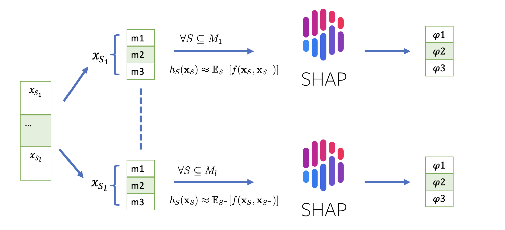

Parallel SHAP is a parallelized version of the popular XAI model SHAP. 

The core idea of Parallel SHAP is to partition the features into "chunks" that are independent to each other. 

A demo is shown as below

